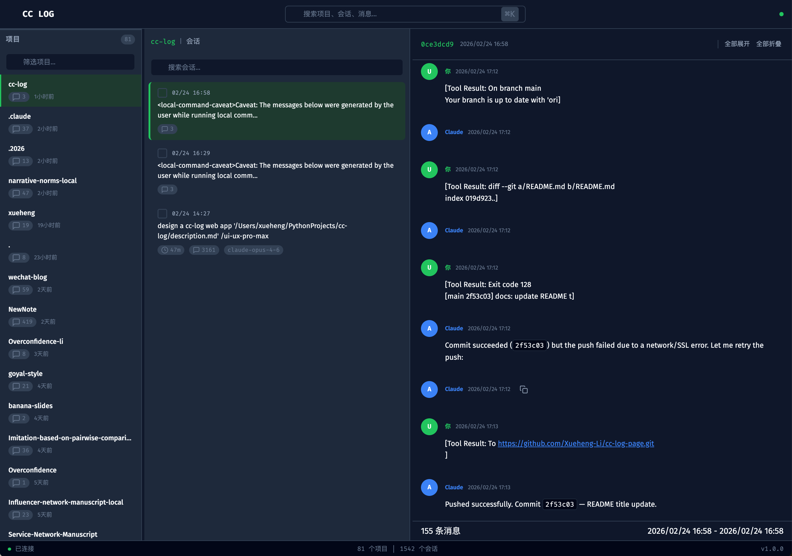

# Claude Code 会话日志查看器

🔍 **Claude Code 会话日志查看器** — 三栏式图形化界面，让你轻松浏览、搜索、导出 Claude Code 的所有历史对话。



docs/screenshots/main.png

## ✨ 功能特性

### 📂 三栏布局
- **项目面板** — 自动扫描 `~/.claude/projects/` 下所有项目，按最近活跃排序
- **会话面板** — 展示选定项目的所有会话，显示首条消息预览、消息数、时长、模型
- **详情面板** — 完整对话内容，区分用户输入、AI 回复、工具调用、系统消息

### 🔎 全局搜索
- `⌘K` 快捷键唤起搜索框
- 跨项目、跨会话全文搜索，毫秒级响应
- 搜索结果按项目分组，点击直达对话上下文

### 📡 实时同步
- WebSocket 实时监听日志变化
- 新会话、新消息自动推送，无需手动刷新
- 底部状态栏显示连接状态

### 📤 导出与分享
- 单会话导出：JSONL / Markdown / HTML 三种格式
- 批量导出：勾选多个会话打包下载 ZIP
- HTML 导出为独立可分享网页

### 🛠️ 更多功能
- 会话 ID 一键复制（方便 `claude --resume`）
- 会话内搜索（`Ctrl+F` 风格）
- 项目/会话筛选过滤
- 工具调用块可展开/折叠
- 思考过程块可展开/折叠
- 键盘快捷键导航（方向键、`Enter`、`Alt+1/2/3`）
- 可拖拽调整面板宽度，自动保存到 localStorage

## 🚀 快速开始

### 环境要求

- Python 3.9+
- Claude Code（已在本机使用过，`~/.claude/projects/` 目录存在）

### 安装

```bash
git clone https://github.com/Xueheng-Li/cc-log-page.git
cd cc-log-page
pip install -r requirements.txt
```

### 运行

```bash
python run.py
```

浏览器将自动打开 `http://localhost:5173`。

**可选参数：**

```bash
python run.py --no-browser    # 不自动打开浏览器
PORT=8080 python run.py       # 指定端口
```

## 📁 项目结构

```
cc-log/
├── run.py                  # 启动入口
├── requirements.txt        # 依赖：fastapi, uvicorn, watchfiles
├── src/
│   ├── __init__.py
│   ├── server.py           # FastAPI 后端（API + WebSocket + 文件监听）
│   └── static/
│       ├── index.html      # 前端页面（Tailwind CSS）
│       └── app.js          # 前端逻辑（原生 JS）
└── README.md
```

## 🔌 API 接口

| 方法 | 路径 | 说明 |
|------|------|------|
| GET | `/api/projects` | 获取所有项目列表 |
| GET | `/api/projects/{id}/sessions` | 获取项目下的会话列表 |
| GET | `/api/sessions/{id}` | 获取会话详情（含所有消息） |
| GET | `/api/search?q=keyword` | 全局搜索 |
| GET | `/api/sessions/{id}/export?format=markdown` | 导出会话 |
| POST | `/api/sessions/batch-export` | 批量导出（ZIP） |
| GET | `/api/sessions/{id}/share` | 生成可分享 HTML |
| GET | `/api/stats` | 系统统计 |
| GET | `/api/health` | 健康检查 |
| WS | `/ws/live` | 实时日志推送 |

## ⌨️ 快捷键

| 快捷键 | 功能 |
|--------|------|
| `⌘K` / `Ctrl+K` | 全局搜索 |
| `↑` `↓` | 在列表中导航 |
| `Enter` | 选择当前项 |
| `Alt+1/2/3` | 切换焦点面板 |
| `Escape` | 关闭弹窗 |

## 🎨 设计

- **暗色主题** — 开发者工具风格，护眼舒适
- **色彩体系** — 背景 `#0F172A`，表面 `#1E293B`，CTA `#22C55E`
- **字体** — Fira Code（标题/代码）+ Fira Sans（正文）
- **图标** — Lucide SVG 图标库
- **中文界面** — 全部文案均为简体中文

## 📋 技术栈

- **后端**：FastAPI + uvicorn + watchfiles
- **前端**：原生 JavaScript + Tailwind CSS（CDN）
- **数据源**：Claude Code JSONL 日志文件（`~/.claude/projects/`）
- **实时通信**：WebSocket

## 📄 许可证

MIT License
